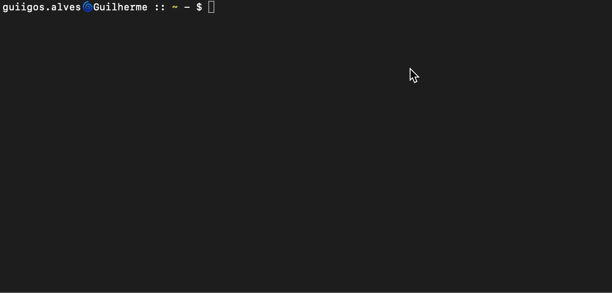

# :scroll: Node Notes CLI


[![Dependencies Status][david-dm-image]][david-dm-url]
[![DevDependencies Status][david-dm-dev-image]][david-dm-dev-url]

[david-dm-image]: https://david-dm.org/guiigos/node-notes-cli/status.svg?style=flat-square
[david-dm-url]: https://david-dm.org/guiigos/node-notes-cli
[david-dm-dev-image]: https://david-dm.org/guiigos/node-notes-cli/dev-status.svg?style=flat-square
[david-dm-dev-url]: https://david-dm.org/guiigos/node-notes-cli?type=dev
[npm-image]: https://nodei.co/npm/node-notes-cli.png?mini=true
[npm-url]: https://nodei.co/npm/node-notes-cli

## Overview
This project was developed for academic purposes to create a CLI for recording annotations using the [commander](https://github.com/tj/commander.js) and [nedb](https://github.com/louischatriot/nedb) to record the data in a local database without configurations.

## Usage
### Install

[![NPM][npm-image]][npm-url]

```sh
$ npm i -g node-notes-cli
```

```sh
$ node-notes --help
```



## License
Project developed for academic purposes.

[](./LICENSE)
